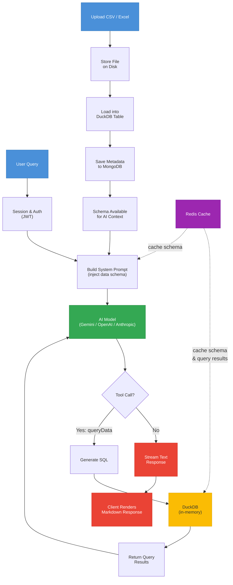

# Toaster AI

<p align="center">
  <picture>
    <source media="(prefers-color-scheme: light)" srcset="https://github.com/user-attachments/assets/868f4ce0-3eed-4d5f-afa0-c8352fa32c16">
    
  </picture>
</p>

<p align="center">
  <strong> Let him cook.</strong>
</p>

Toaster is a suite of AI tools built specifically for accountants. Upload financial spreadsheets or CSV files, ask questions in natural language, and Toaster will query your data using DuckDB to deliver real-time AI-powered results. Imagine Claud, but built specifically for accounting.


## Table of Contents

- [Overview](#overview)
- [Prerequisites](#prerequisites)
- [Installation](#installation)
- [Configuration](#configuration)
- [Development](#development)
- [Production](#production)
- [API Documentation](#api-documentation)
- [Available Scripts](#available-scripts)
- [License](#license)

## Overview

Toaster turns complex accounting inquiries into instant, data-backed answers. Upload CSV or Excel files containing financial data, and the AI assistant will query them directly using SQL -- no manual pivot tables, manual calculations, or formula-based lookups.

**Key Capabilities:**

-  **Multi-Provider AI Chat** -- Google Gemini, OpenAI, and Anthropic models with streaming responses

-  **Dataset Upload & Querying** -- Upload CSV and Excel files; Toaster loads them into DuckDB for fast analytical queries

-  **Tool-Augmented Responses** -- The AI calls a `queryData` tool to run SQL against your uploaded data and weave results into its answers

-  **Session Management** -- Persistent chat sessions with auto-generated titles and configurable TTL

-  **JWT Authentication** -- Secure login with token invalidation and per-user data isolation

-  **Schema-Aware Context** -- The AI system prompt automatically includes your data schema so it knows your columns, types, and row counts

-  **Redis Caching** -- Optional Redis layer for caching schemas and query results

-  **Dark / Light Theme** -- User-persisted theme preference

<br>
  


**Data Privacy & Local Storage:**

Uploaded files are stored on the local disk rather than external storage services or cloud providers. This is a deliberate design choice to keep the user in full control of their data — especially important for sensitive financial records like ledgers, trial balances, payroll exports, and tax worksheets.

Your files are never stored by third-party providers. Each user’s data is isolated in its own directory, and DuckDB processes queries entirely in memory. Your data remains fully local at all times.


### Runtime

-  **Bun** >= 1.0 -- JavaScript/TypeScript runtime and package manager

## Prerequisites

- [Bun](https://bun.sh) >= 1.0
- [MongoDB](https://www.mongodb.com/) (local or Atlas)
- [Redis](https://redis.io/) (optional, for caching)
- At least one AI provider API key (Google, OpenAI, or Anthropic)

### Installing Bun

If you don't have Bun installed:

**macOS / Linux:**
```bash
curl  -fsSL  https://bun.sh/install | bash
```

**Windows:**
```bash
powershell  -c  "irm bun.sh/install.ps1|iex"
```

Verify installation:
```bash
bun  --version
```

## Installation

1. Clone the repository:
```bash
git clone <your-repo-url>
cd toaster
```

2. Install all dependencies:
```bash
bun run install:all
```

Or install separately:

```bash
# Root dependencies
bun  install
# Client dependencies
cd  client && bun  install
# Server dependencies
cd  server && bun  install
```
  
3. Set up environment variables:
```bash
cp  server/.env.example  server/.env
```

## Configuration

Edit `server/.env` with your values:

- **`PORT`** – Server port (default: `3000`)
- **`NODE_ENV`** – Application environment (default: `development`)
- **`DEBUG_MODE`** – Include stack traces in errors (default: `false`)
- **`CLIENT_URL`** – Allowed CORS origin (default: `http://localhost:5173`)
- **`MONGODB_URI`** – MongoDB connection string
- **`JWT_SECRET`** – Secret for signing JWT tokens
- **`JWT_EXPIRES_IN`** – Token expiration (default: `7d`)
- **`CHAT_SESSION_TTL_HOURS`** – Chat session TTL (default: `8`)
- **`DATA_DIR`** – Upload storage directory (default: `./data`)
- **`REDIS_URL`** – Redis URL (optional, default: `redis://localhost:6379`)
- **`GOOGLE_GENERATIVE_AI_API_KEY`** – Google Gemini API key
- **`OPENAI_API_KEY`** – OpenAI API key
- **`ANTHROPIC_API_KEY`** – Anthropic API key

You need at least one AI provider key. Google Gemini is the default model.


## Development

Run both client and server concurrently:

```bash
bun  run  dev
```

Or run separately:

```bash
# Client only (http://localhost:5173)
bun  run  dev:client
# Server only (http://localhost:3000)
bun  run  dev:server
```

### Stack
- React 18 with TypeScript -- UI framework
- Vite 6 -- Build tool and dev server
- Tailwind CSS 4 -- Utility-first styling
- shadcn/ui -- Component library (Radix UI primitives)
- Vercel AI SDK (ai, @ai-sdk/google, @ai-sdk/openai, @ai-sdk/anthropic) -- Multi-provider AI integration
- NestJS 10 with TypeScript -- Backend framework
- MongoDB (via Mongoose 9) -- Users, sessions, file metadata
- DuckDB (@duckdb/node-api) -- In-memory analytical queries on uploaded data
- Redis -- Optional caching layer for schemas and query results
- JWT (@nestjs/jwt) -- Authentication and authorization
- Swagger (@nestjs/swagger) -- API documentation
- Zod -- Runtime validation for AI tool parameters

## Production

Build and start:

```bash
bun  run  build
bun  run  start
```

## API Documentation

When the server is running, Swagger docs are available at:
http://localhost:3000/api/v1/docs

  
## Available Scripts

- **`bun run install:all`** – Install dependencies for root, client, and server  
- **`bun run dev`** – Run client and server concurrently (dev mode)  
- **`bun run dev:client`** – Run client only  
- **`bun run dev:server`** – Run server only  
- **`bun run build`** – Build client and server  
- **`bun run start`** – Start production server  
- **`bun run lint`** – Lint entire project

## License
This project is licensed under the MIT License.
